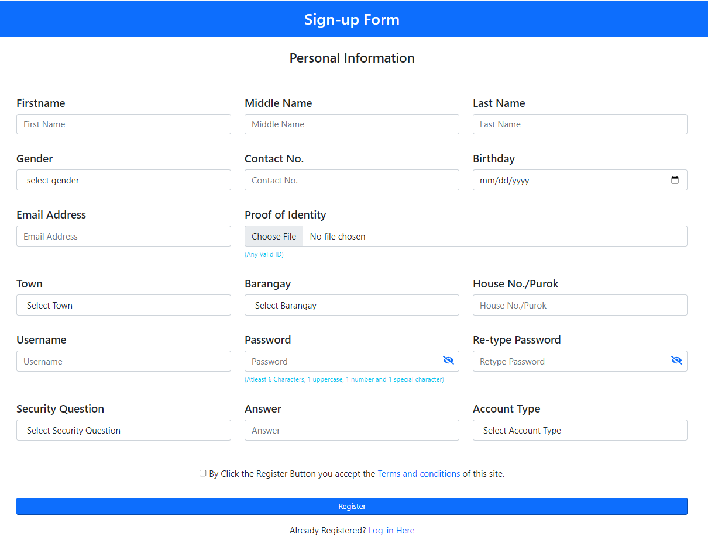
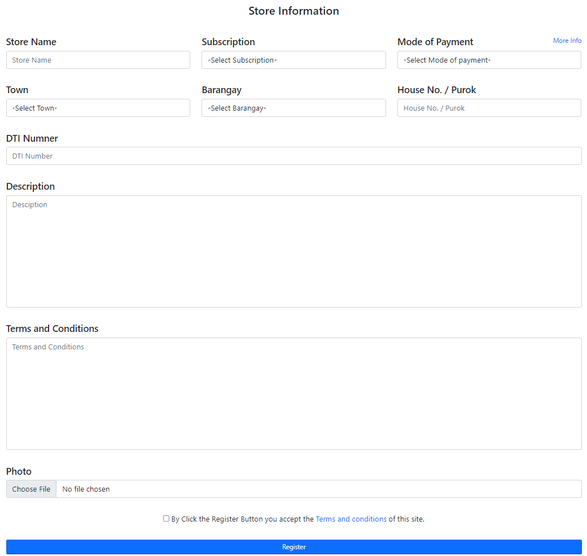
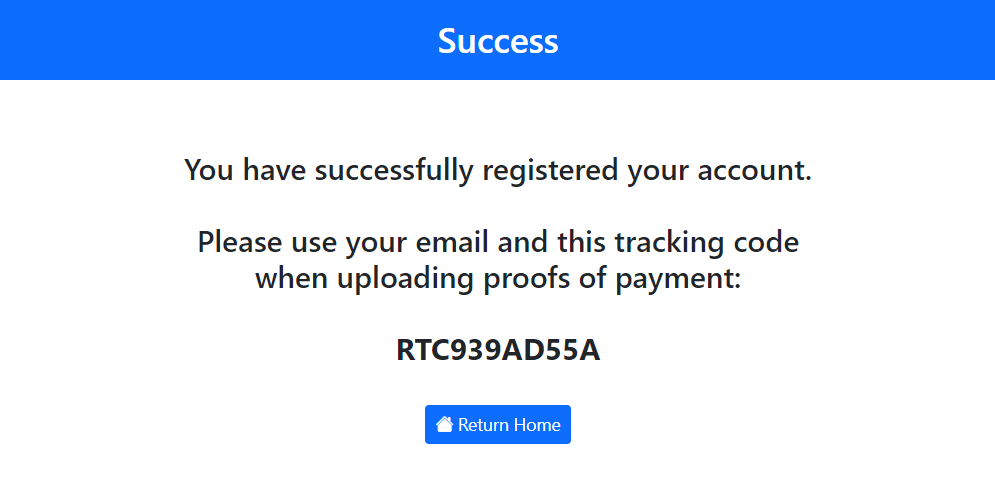
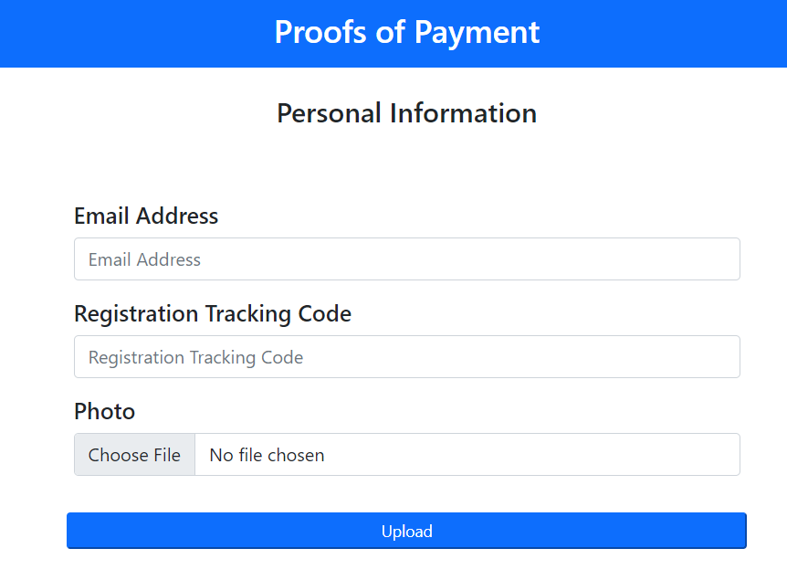
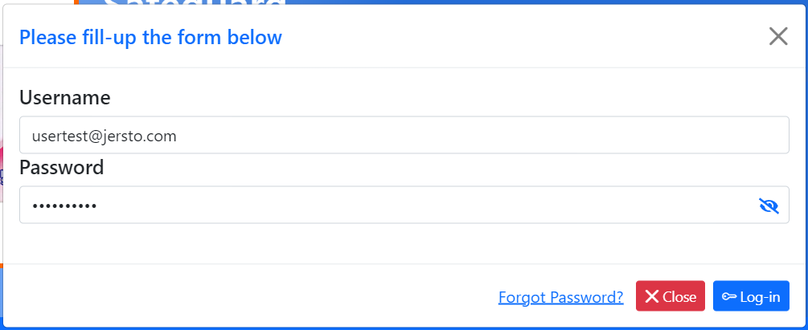

# User Accounts and Authentication
On this page, we will guide you on how to sign in and register for a new account on Emart.

## Register as a Merchant
To Register a Merchant account please follow the step by step procedure below:

1. Open the Emart website on the browser by entering the url `localhost/e-mart`.
2. In the top navigation of the website click on the `Account` navigation and the `Sign Up` menu option.
3. After clicking the `Sign Up` option a new page will appear with a Form like this. 
4. Fill out all the input fields except for the Account Type.
5. On the Account type input, please select the Merchant option and a new Form extension will appear for the Store Information. 
6. Fill out all the input fields on the Store Information and check the Agreement box.
7. After that click Register and the system will register your account and return a new page with a success message that looks like this. 
8. Save the RTC for verification later.
9. Finally you may proceed to Account Verification.

## Register as Customer
To Register a Customer account please follow the step by step procedure below:

## Merchant Account Verification
If your merchant account is newly registered and you login for the first time the website will not let you Sign In because the admin hasnt approved it yet.
For your account to be approved you have to submit a proof of payment by following the steps below:

1. On the the top navigation of the website click `Account` and choose Proof of Payment
2. A new form will appear that looks like this.  
3. Fill out all the input fields and click Upload.
4. Wait for the Administrator to approved your account.
5. if your account has been approved you may continue to Sign In.

## Sign In
To Sign In your registered accounts please follow the step by step procedure below:

1. To Sign In click the `Account` navigation on the top of the website and choose `Log-In`.
2. A new Form will appear.  
3. Enter your Username and Password.
4. Click `Log-In`, depending on your account you will be redirected to a new page.
5. Sign In is finished.

