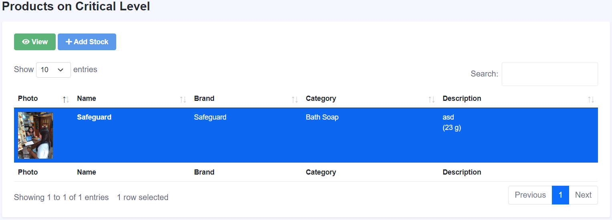

# Merchants

This section provides comprehensive guidelines on managing your Merchant Account, including the management of stores, orders, and other related functionalities. You will find detailed instructions and step-by-step procedures to effectively handle various aspects of your merchant account, ensuring seamless operations and enhanced customer satisfaction.

## Products

### Adding New Product

To add new product to your store please follow the steps below:

1. Open your Emart account using your merchant account.
2. On the sidebar of the Merchant Interface click `Products` menu and select the `All Products` option.
3. Click the `new` button and a new Form will appear. 
4. Fill out all the input fields and click the `Save` button below.
5. The new product will be added.  

### Critical level

To view products that are on low stock or in critical level, follow the steps below:

1. Open your Emart account using your merchant account.
2. On the sidebar of the Merchant Interface click `Products` menu and select the `On Critical Level` option.
3. The list of product will appear like below.  
4. Choose a product and click `view` to view more details.  
5. You can also have an option to add stocks to update the Inventory.

### Adding Product Stocks

To add product stocks please follow the steps below:

1. Open your Emart account using your merchant account.
2. On the sidebar of the Merchant Interface click `Products` menu and select the `All Products` option.
3. On the page that will appear click a product and click `Add Stocks` button.
4. A new Form will appear that looks like this.  
5. Fill out all the input fields on the form and click `Add Stock` button.
6. After Adding stock a success message will appear indicating that the stock is updated successfully.

### Updating Product Information

1. Open your Emart account using your merchant account.
2. On the sidebar of the Merchant Interface click `Products` menu and select the `All Products` option.
3. On the page that will appear click a product and click `Edit` button.
4. A new Form will appear that looks like this.  
5. Change the input field of the information that you want to change then click `Save` button.
6. After saving, a message will appear indicating that product is successfully updated.

### Deleting a product

1. Open your Emart account using your merchant account.
2. On the sidebar of the Merchant Interface click `Products` menu and select the `All Products` option.
3. On the page that will appear click a product and click `Delete` button.
4. After deleting, a message will appear indicating that product is successfully deleted.

### Expired Products

1. Open your Emart account using your merchant account.
2. On the sidebar of the Merchant Interface click `Products` menu and select the `Expired` option.
3. A table will appear containing all the expired products

### Disposed Products

1. Open your Emart account using your merchant account.
2. On the sidebar of the Merchant Interface click `Products` menu and select the `Expired` option.
3. A table will appear containing all the expired products
4. Select a product from the table and click `Dispose`.
5. You can view all the disposed products on the `Disposed` option under the `Products` menu.

## Orders

### Viewing Pending Orders

1. Open your Emart account using your merchant account.
2. On the sidebar of the Merchant Interface click `Orders` menu and select the `Pending` option.
3. Select an order from the list and click the `View` button.
4. A new pop-up will appear containing a detailed list of all the orders.

### Confirming Pending Orders

1. Open your Emart account using your merchant account.
2. On the sidebar of the Merchant Interface click `Orders` menu and select the `Pending` option.
3. Select an order from the list and click the `Confirm Order` button.

### Cancelling Pending Orders

1. Open your Emart account using your merchant account.
2. On the sidebar of the Merchant Interface click `Orders` menu and select the `Pending` option.
3. Select an order from the list and click the `Cancel` button.

### Viewing For Delivery Items

1. Open your Emart account using your merchant account.
2. On the sidebar of the Merchant Interface click `Orders` menu and select the `For Delivery` option.
3. Select an order from the list and click the `View Order` button to show more details about the order.

### Viewing For PickUp Items

1. Open your Emart account using your merchant account.
2. On the sidebar of the Merchant Interface click `Orders` menu and select the `For Pickup` option.
3. Select an order from the list and click the `View Order` button to show more details about the order.
4. Select an order from the list and click the `Picked Up` button to marked the order as Picked Up.

### Printing Receipts

1. Open your Emart account using your merchant account.
2. On the sidebar of the Merchant Interface click `Orders` menu and select the `For Delivery`, `Completed` or `For Pickup` option.
3. Select an order from the list and click the `Print receipt` button to print the receipt.

### Viewing Cancelled Orders

1. Open your Emart account using your merchant account.
2. On the sidebar of the Merchant Interface click `Orders` menu and select the `Cancelled` option.
3. Select an order from the list and click the `View Order` button to show more details about the order.

### Viewing Completed Orders

1. Open your Emart account using your merchant account.
2. On the sidebar of the Merchant Interface click `Orders` menu and select the `Completed` option.
3. Select an order from the list and click the `View Order` button to show more details about the order.

## Running Inventory

## Delivery Charge

## Mode of Payment

## Reports

### Sales Report

### Product Inventory